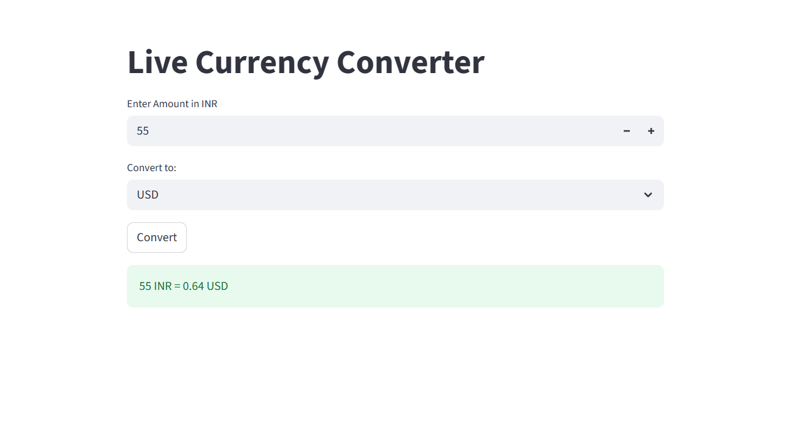

# 💱 Currency Converter UI


A sleek and simple **Currency Converter** web app with a modern UI. Easily convert between major currencies with live exchange rates.

---

## 🚀 Features

- 🔄 Real-time currency conversion
- 🌐 Fetches live exchange rates via API
- 📱 Responsive and clean user interface
- 🖱️ Dropdown-based currency selection
- ⚡ Fast and lightweight

---

## 🧩 Tech Stack

- Streamlit
- [ExchangeRate API](https://www.exchangerate-api.com/)

---

## 📸 Screenshots



---

### 🔧 Run Locally

1. Clone the repository:
```bash
git clone https://github.com/neerajkumarsi20/Currency-Convertor-UI.git
cd Currency-Convertor-UI
